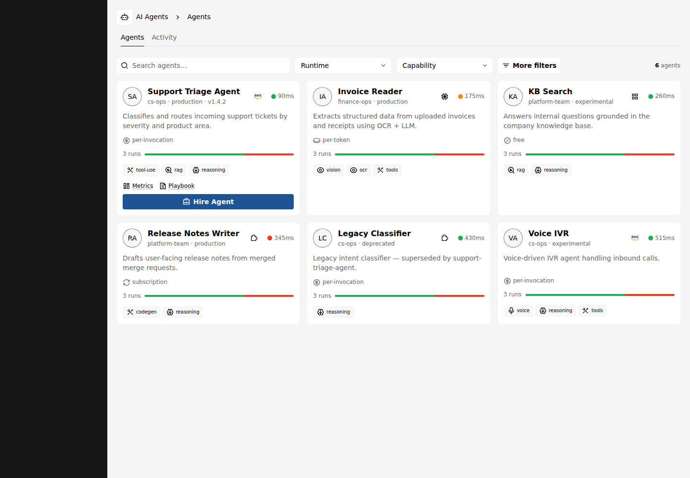
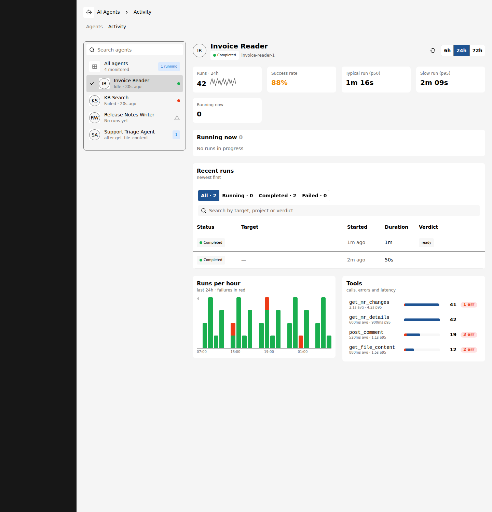
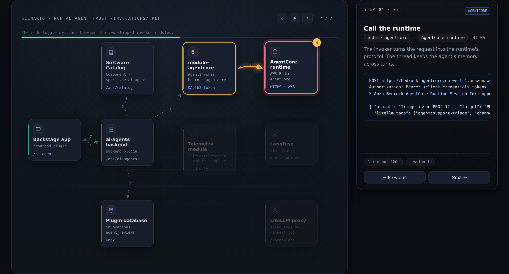

# AI Agents plugin for Backstage

Catalog your AI agents in Backstage and give people one place to find them,
check that they are up, run them and see what they did.

An agent is an ordinary catalog `Component` with `spec.type: ai-agent`, so it
keeps ownership, relations, search and permissions like any other component.
The plugin adds:

- an **AI Agents** page (`/ai-agents`) with a card per agent, filters and a
  detail drawer;
- live **status** (healthy / degraded / down) from each agent's health URL;
- a **Hire** dialog that runs an agent from Backstage as a multi-turn
  conversation, dry run first;
- **reviews** (0–5 stars) and invocation **history**;
- **spend** per agent and per conversation, read from a LiteLLM proxy;
- an **Activity** view of runs and tool calls, read from your telemetry store;
- an overview card, an invocations card and an Activity tab on the agent's
  entity page.

Each backend feature is optional. Without the backend the page still lists
agents; it just has no status, runs or history.

| Agents                                             | Activity                                       |
| -------------------------------------------------- | ---------------------------------------------- |
|  |  |

How the frontend, the backend and its modules work together is described in
[docs/architecture.md](docs/architecture.md), with an interactive version in
[docs/architecture.html](docs/architecture.html):



## Packages

| Package                                                                                                               | What it does                                                 |
| --------------------------------------------------------------------------------------------------------------------- | ------------------------------------------------------------ |
| [`@acarmisc/backstage-plugin-ai-agents`](packages/plugin-ai-agents)                                                   | Frontend: page, cards, drawer, Hire dialog, Activity view    |
| [`@acarmisc/backstage-plugin-ai-agents-backend`](packages/plugin-ai-agents-backend)                                   | Backend: status probing, invocations, reviews, spend, routes |
| [`@acarmisc/backstage-plugin-ai-agents-backend-module-agentcore`](packages/plugin-ai-agents-backend-module-agentcore) | Runs agents hosted on AWS Bedrock AgentCore                  |
| [`@acarmisc/backstage-plugin-ai-agents-backend-module-kagent`](packages/plugin-ai-agents-backend-module-kagent)       | Runs agents hosted on [kagent](https://kagent.dev) (A2A)     |
| [`@acarmisc/backstage-plugin-ai-agents-backend-module-langfuse`](packages/plugin-ai-agents-backend-module-langfuse)   | Reads agent runs from [Langfuse](https://langfuse.com)       |

Each package README covers its installation and configuration.

## Requirements

- Backstage 1.53 or later.
- The [new frontend system](https://backstage.io/docs/frontend-system/) and the
  [new backend system](https://backstage.io/docs/backend-system/). Apps on the
  legacy frontend system are not supported.
- A database for invocation history and reviews (the plugin's own Knex
  migrations create the tables). Without one those features return `501`.

## Getting started

1. Install the frontend and backend:

   ```bash
   yarn --cwd packages/app add @acarmisc/backstage-plugin-ai-agents
   yarn --cwd packages/backend add @acarmisc/backstage-plugin-ai-agents-backend
   ```

2. Register the backend in `packages/backend/src/index.ts`:

   ```ts
   backend.add(import('@acarmisc/backstage-plugin-ai-agents-backend'));
   ```

3. If your app does not discover features automatically, add the frontend
   plugin to `createApp`:

   ```ts
   import aiAgentsPlugin from '@acarmisc/backstage-plugin-ai-agents';

   export default createApp({ features: [aiAgentsPlugin] });
   ```

4. Allow the backend to probe your agents' health URLs:

   ```yaml
   # app-config.yaml
   ai-agents:
     probeAllowlist:
       - https://*.agents.example.com
   ```

5. Add the modules for the runtimes and telemetry store you use (see their
   READMEs), then describe an agent in the catalog.

## Describing an agent

```yaml
apiVersion: backstage.io/v1alpha1
kind: Component
metadata:
  name: support-triage
  title: Support Triage
  description: Classifies incoming tickets by severity and product area.
  annotations:
    ai-agent.io/runtime: kagent
    ai-agent.io/runtime-handle: support-triage
    ai-agent.io/health: https://support-triage.agents.example.com/healthz
    ai-agent.io/capabilities: 'tool-use:tools,rag:retrieval'
    ai-agent.io/billing-model: per-token
  links:
    - url: https://grafana.example.com/d/support-triage
      title: Metrics
spec:
  type: ai-agent
  lifecycle: production
  owner: group:default/support
```

Only `spec.type: ai-agent` is required (the match is case-sensitive). Agents
reach the catalog the same way as other components, through a location or an
entity provider.

### Annotations

All annotations are optional. Entities that still use the old
`ai-agent.acarmisc.org/` prefix keep working.

| Annotation                    | Purpose                                                                                                                                  |
| ----------------------------- | ---------------------------------------------------------------------------------------------------------------------------------------- |
| `ai-agent.io/runtime`         | Runtime name, e.g. `bedrock-agentcore` or `kagent`. Picks the invoker module and the badge. Default `custom`.                            |
| `ai-agent.io/runtime-handle`  | The runtime's id for the agent: AgentCore runtime ARN, kagent agent name.                                                                |
| `ai-agent.io/region`          | AWS region of an AgentCore runtime.                                                                                                      |
| `ai-agent.io/namespace`       | Kubernetes namespace of a kagent agent.                                                                                                  |
| `ai-agent.io/endpoint`        | The agent's endpoint. Probed when `health` is not set. For kagent, overrides the controller URL.                                         |
| `ai-agent.io/health`          | URL probed for live status.                                                                                                              |
| `ai-agent.io/telemetry-id`    | The agent's name in the telemetry store. Enables the Activity view.                                                                      |
| `ai-agent.io/purpose`         | Card text; defaults to `metadata.description`.                                                                                           |
| `ai-agent.io/avatar`          | Image: `http(s)` URL, `data:image/*` URI or app-relative path. Private-repo images load through the backend. Initials otherwise.         |
| `ai-agent.io/squad`           | Team the agent belongs to. Falls back to `spec.system`. Drives the Squad filter and the Group by Squad view.                             |
| `ai-agent.io/version`         | Shown in the card footer.                                                                                                                |
| `ai-agent.io/capabilities`    | Comma- or newline-separated chips, `label` or `label:category` (`reasoning`, `retrieval`, `tools`, `vision`, `voice`, `data`, `safety`). |
| `ai-agent.io/billing-model`   | `per-invocation`, `per-token`, `subscription` or `free` (default).                                                                       |
| `ai-agent.io/cost-per-1k`     | Cost per 1000 invocations, or per 1M tokens for `per-token`.                                                                             |
| `ai-agent.io/budget`          | Monthly budget.                                                                                                                          |
| `ai-agent.io/hire-schema`     | JSON array describing the Hire form. See [Running agents](#running-agents).                                                              |
| `ai-agent.io/prompt-template` | Prompt with `{field}` placeholders filled from the Hire form.                                                                            |

## Running agents

An agent with a `hire-schema` gets a **Hire** button. The schema is a JSON
array of form fields:

```yaml
ai-agent.io/hire-schema: >-
  [{"name":"target","label":"Issue","type":"text","required":true},
   {"name":"action","label":"Action","type":"select","options":["dry-run","post"],"default":"dry-run"}]
ai-agent.io/prompt-template: 'Triage issue {target}.'
```

| Field      | Description                                                 |
| ---------- | ----------------------------------------------------------- |
| `name`     | Key of the value and of the `{name}` placeholder (required) |
| `label`    | Input label (required)                                      |
| `type`     | `text` (default), `url`, `textarea`, `select` or `number`   |
| `required` | Whether the field must be filled                            |
| `default`  | Initial value                                               |
| `options`  | Choices of a `select`                                       |
| `help`     | Helper text under the input                                 |

An invalid schema hides the button instead of breaking the card.

The backend sends the filled prompt together with structured fields
(`target`, `project`, `model`, `mode`, `post`). Two of them need care:

- **`post` is always sent and defaults to `false`.** Agents can treat it as
  "allowed to write" (post a comment, open a ticket). The dialog runs a dry run
  first and only sends `post: true` from its **Confirm and publish** button,
  shown when the schema has an `action` or `post` field.
- **Conversations keep their thread.** Follow-up messages reuse the thread id,
  which becomes the AgentCore session id or the A2A `contextId`, so the agent
  keeps its memory across turns.

Without an invoker module for the agent's runtime the dialog falls back to a
copyable request preview. To support another runtime, implement `AgentInvoker`
and register it from a backend module; see the
[backend README](packages/plugin-ai-agents-backend#extension-point).

## Permissions

| Permission              | Action   | Checked on                                             |
| ----------------------- | -------- | ------------------------------------------------------ |
| `ai-agent.invoke`       | `update` | `POST /invocations/:ref`                               |
| `ai-agent.history.read` | `read`   | `GET /invocations/:ref`, `GET /invocations/:ref/spend` |

Every route also reads the catalog on behalf of the caller, so a user only
sees, probes and runs agents their catalog permissions let them read.

## Security notes

- Status probing is deny-by-default: the backend only fetches URLs whose origin
  matches `ai-agents.probeAllowlist`.
- Agent avatars are fetched through the backend with the integrations'
  credentials, only from the integrations' hosts (or
  `ai-agents.avatarProxy.allowlist`), and only image content is served.
- Catalog authors control annotations, so annotation values are treated as
  untrusted: links are rendered only for `http(s)`, the AgentCore region must
  be a valid AWS region, and the kagent `authHeader` is only sent to the
  configured controller.
- The Langfuse module reads observation metadata only, never prompts, model
  output or tool arguments.

Report vulnerabilities as described in [SECURITY.md](SECURITY.md).

## Development

```bash
npm install --legacy-peer-deps
npm run build      # build before typecheck and test: modules use the backend's dist types
npm run lint
npm run typecheck
npm test
cd packages/plugin-ai-agents && npm start   # frontend with sample agents, no backend
```

See [CONTRIBUTING.md](CONTRIBUTING.md) for conventions and the release process,
[docs/architecture.md](docs/architecture.md) for how the pieces talk to each
other and [docs/activity.md](docs/activity.md) for the Activity view and the
telemetry provider contract.

## License

[Apache-2.0](LICENSE)
